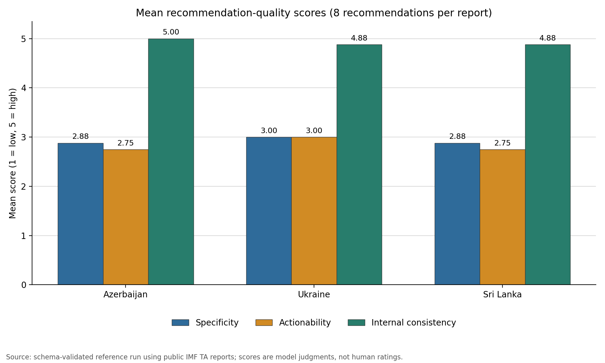

# Monetary Policy Instrument Extraction

A source-grounded AI assistant for extracting monetary-policy instruments, reviewing monetary-operations write-ups, assessing IMF recommendations, and structuring policy signals from central-bank speeches. The project turns the four assignment tasks into reusable prompt templates, strict Pydantic contracts, a Streamlit chatbot, and a reproducible analysis of 24 recommendations from three public IMF technical-assistance reports.



## What the project delivers

| Part | Workflow | Output |
|---|---|---|
| A | Extract instruments from a central-bank excerpt | Instrument, stated use, and source evidence |
| B | Review or draft a monetary-operations section | Five-element coverage check, contradictions, follow-up questions, and IMF-style prose |
| C | Evaluate recommendations against a TA report body | Separate 1–5 scores for specificity, actionability, and internal consistency, with evidence-backed justifications |
| D | Extract signals from a BIS speech | One JSONL-ready record with tone, forward-path commitment, stance driver, and a self-contained rationale |

Every model response is validated before it is shown or exported. The interface supports JSON and CSV downloads for all four tasks, plus JSONL for sequential speech processing.

## Part C findings

The checked-in reference analysis covers eight recommendations from each of three IMF reports:

| Report | Specificity | Actionability | Internal consistency | Overall |
|---|---:|---:|---:|---:|
| Azerbaijan | 2.88 | 2.75 | 5.00 | 3.56 |
| Ukraine | 3.00 | 3.00 | 4.88 | 3.64 |
| Sri Lanka | 2.88 | 2.75 | 4.88 | 3.51 |
| **All 24 recommendations** | **2.92** | **2.83** | **4.92** | **3.57** |

The selected recommendations are strongly aligned with their report bodies, but their table wording is often less specific or actionable when read by itself. Across the sample, 22 recommendations received an overall `Medium` rating and two received `High`; none received `Low`. See the [full interpretation](reports/recommendation_quality_report.md), [executed notebook](notebooks/01_recommendation_quality_assessment.ipynb), and [row-level results](data/results/recommendation_quality_assessments.csv).

These are schema-constrained model judgments from one purposive sample, not human ratings or a representative assessment of all IMF TA reports.

## Quick start

Python 3.11 or newer is required.

```bash
python -m venv .venv
source .venv/bin/activate
python -m pip install --upgrade pip
python -m pip install -e '.[dev,analysis]'
```

Provide a key in the launching shell:

```bash
export OPENAI_API_KEY='your-key-here'
export OPENAI_MODEL='gpt-5.6-terra'  # optional; this is the project default
```

Then launch the chatbot:

```bash
streamlit run app.py
```

You can also leave `OPENAI_API_KEY` unset and paste a key into the app's password field. The app passes it directly to the SDK for that process and never writes it to disk.

The implementation uses the [OpenAI Responses API](https://developers.openai.com/api/docs/guides/text) and [Structured Outputs](https://developers.openai.com/api/docs/guides/structured-outputs) to enforce the same contracts defined in `src/mpie/schemas.py`.

## Assignment deliverables

The concise written response for Parts A–D is in [docs/assignment_response.md](docs/assignment_response.md). The complete prompts are version controlled separately:

- [Part A: instrument extraction](prompts/part_a_instrument_extraction.md)
- [Part B: operations review and drafting](prompts/part_b_operations_drafting.md)
- [Part C: recommendation quality](prompts/part_c_recommendation_quality.md)
- [Part D: policy signal extraction](prompts/part_d_policy_signal.md)
- [Prompt design notes](docs/prompt_design_notes.md)

## Reproduce the IMF analysis

The manifest contains authoritative URLs, page ranges, publication metadata, and SHA-256 hashes. Downloaded PDFs and full text extracts are intentionally excluded from GitHub; the pipeline recreates them locally.

```bash
# 1. Download the three reports, extract page-aware text, and render review pages.
python scripts/download_and_extract_imf.py --render

# 2. Join the reviewed recommendation sample to report bodies and render prompts.
PYTHONPATH=src python scripts/prepare_reference_assessments.py

# 3. Run the three structured evaluations. This step uses OPENAI_API_KEY.
PYTHONPATH=src python scripts/run_imf_evaluation.py

# 4. Validate source identity, verbatim text/evidence, and compile results and chart.
PYTHONPATH=src python scripts/compile_reference_assessments.py

# 5. Rebuild the analysis notebook; execute it in Jupyter before committing changes.
python scripts/build_notebook.py
jupyter nbconvert --to notebook --execute --inplace \
  notebooks/01_recommendation_quality_assessment.ipynb
```

The checked-in results were produced with `gpt-5.6-terra` at medium reasoning effort through Codex sign-in. The API script provides a portable rerun path, but model updates and sampling can produce different scores.

### Public source reports

- [Azerbaijan: Modernizing Central Bank Communication](https://www.imf.org/en/publications/technical-assistance-reports/issues/2025/02/12/azerbaijan-technical-assistance-report-modernizing-central-bank-communication-561816) (2025)
- [Ukraine: Counterparty Eligibility and Emergency Liquidity Assistance](https://www.imf.org/en/publications/technical-assistance-reports/issues/2025/06/25/ukraine-technical-assistance-report-review-of-the-counterparty-eligibility-for-monetary-568011) (2025)
- [Sri Lanka: Liquidity Monitoring and Monetary Operations](https://www.elibrary.imf.org/view/journals/019/2024/078/019.2024.issue-078-en.xml) (2024)

Details on selection and extraction are in [data/reports/README.md](data/reports/README.md).

## Project structure

```text
.
├── app.py                         # Streamlit chatbot
├── src/mpie/                      # Prompts, schemas, API adapter, service layer
├── prompts/                       # Complete A-D prompt templates
├── docs/                          # Written assignment response and design notes
├── data/
│   ├── reports/                   # Source manifest and reviewed recommendations
│   └── results/                   # Validated Part C results and summary
├── reports/                       # Interpretation and chart
├── notebooks/                     # Executed analytical notebook
├── scripts/                       # Download, evaluation, compilation, and notebook tools
└── tests/                         # Offline unit and artifact-integrity tests
```

## Validation

Run the complete local checks with:

```bash
ruff check .
ruff format --check .
pytest
python -m compileall -q app.py src scripts tests
```

Unit tests use fake clients and do not make live API requests. Artifact tests verify the three-report/24-recommendation scope, score bounds, unique IDs, chart presence, and successful notebook execution.

## Data and security notes

- API keys, `.env` files, local outputs, downloaded PDFs, extracted full text, and rendered report pages are ignored by Git.
- The committed recommendation sample preserves source wording, including one deliberately retained incomplete Sri Lanka table item used as an edge case.
- Evidence validation checks exact source substrings and structural fidelity; it does not replace expert review of the model's substantive judgments.
